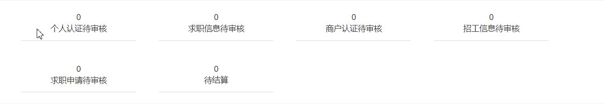
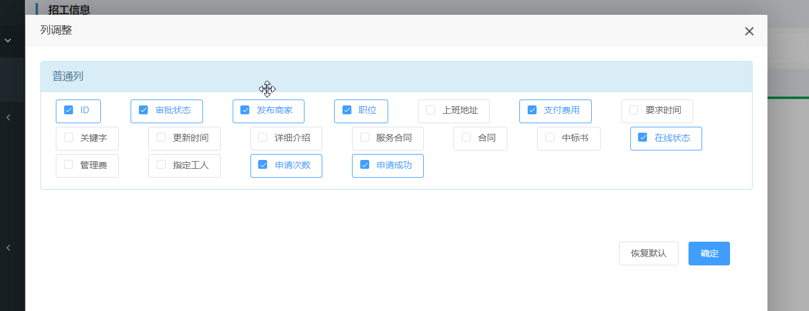
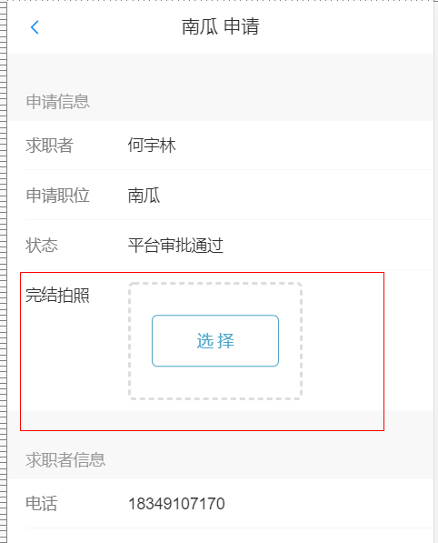

# 更新日志

## 2020-07-18

### 首页统计面板
更新首页面板，修正跳转bug，按照客户需求调整顺序

### 申请统计

在`商家 > 招工信息` 页面增加`申请次数`与`申请成功`统计功能。

### 页面字段显示设置

在`商家 > 招工信息`等几个字段较多的页面增加`设置列`按钮。弹出界面可以设置想要显示的字段，并且可以拖动调整显示顺序。做出的修改会保存在本地。凡是有`设置列`按钮的页面，也具备列宽记忆功能。

### 招工指定多人

对于`招工信息`，现在加入了指定多人的功能。

### 完结拍照

在商户的移动界面下，当状态为`平台审批通过`时，会显示`完结拍照`字段，用户可以拍照上传作为完结依据。

